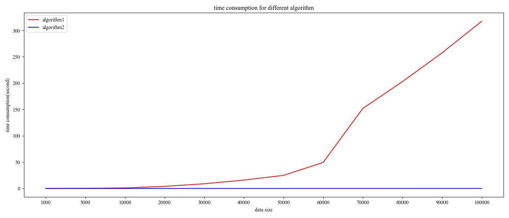

# Time-Complexity-Analysis
Analysis time complexity of two different algorithms.

Description: design two different adaptive cluster algorithm and compare time consumption.
Algorithm: For any $x$ belonging to list A, if $|x-y| <= step$, then $y$ belongs to the same list A.

results:

  

